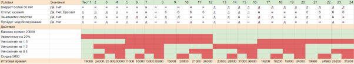

## Раздел 1 Тест-дизайн / Чек-листы - 

### **Классы эквивалентности / Попарное тестирование / Граничные значения**

Тестирование формы - Перевод между счетами. С помощью данной формы можно осуществлять перевод между своими счетами.

Для составления матрицы попарного тестирования сначала были определены классы эквивалентности исходя из требований к форме:

1) Счет списания - Валюта: Рубль / Доллар / Евро / Франк / Юань

2) Счет зачисления - Валюта: Рубль / Доллар / Евро / Франк / Юань

3) Счет списания - Тип: Текущий / Зарплатный / Накопительный / Кредитный / Депозитный

4) Счет зачисления  - Тип: Текущий / Зарплатный / Накопительный / Кредитный / Депозитный

Сумма переводов: Валидное / Невалидное / Пустое

Далее воспользовавшись инструментом Pairwise online tool заполнил матрицу

Сгенерировал результат:

Далее дополнил тест-кейсам с граничными значениями суммы перевода, исходя из требований к форме.

REQ09. Для допустимых сумм перевода по умолчанию должны быть установлены следующие допустимые суммы:

Российский рубль: 999999.99

Евро: 1500

Доллар США: 2000

Юань: 12000

Швейцарский франк: 1500

*Например, для рубля: -0.01 / 0.00 / 0.01 / 999999.98 / 999999.99 / 1000000,00*

После разбил тесты на позитивные и негативные, добавив кейсы с  различными типами невалидных значений для поля ввода “Сумма перевода”. Также добавил негативные тесты для различных типов счетов согласно дополнительным условиям перевода (к примеру, запрещено списывать средства с кредитного счета)

Тест-кейсы оформил в Qase, всего получилось 84 теста.

### **Примеры багов обнаруженных в форме:**

1) **ID: TGB-41**

**Название:** Возможно перевести сумму превышающую лимит с рублевого счета.

Тестовые данные: Тестов Николай Первый - логин: “TestNikP” / пароль “testPass\_1”

**Серьезность:** Major

**Приоритет:** Высокий

**Предварительные шаги:**

1) Зайти на сайт {TEST}GROW BANK
2) Авторизоваться пользователем “Тестов Николай Первый”
3) Зайти на ЭФ “Перевод между счетами”

**Шаги воспроизведения:**

1) Перейти на ЭФ «Перевод между счетами»
2) Выбрать допустимый рублевый счет с остатком более «1000000,00»
3) Выбрать рублевый счет зачисления
4) В поле сумма ввести значение «1000000,00»
5) Нажать кнопку «Перевести»

**Ожидаемый результат:** Перевод невозможен, сообщение о превышении лимита.

**Фактический результат:** Перевод осуществляется.

**Тестовая среда:** Устройство - Acer Nitro 5 / Chrome 125.0.6422.142

2) **ID: TGB-57**

**Название:** Не отображаются счета валюты «Юань» в выпадающем списке ЭФ «Перевод между счетами».

**Серьезность:** Major

**Приоритет:** Высокий

**Тестовые данные:** Тестов Николай Первый - логин: “TestNikP” / пароль “testPass\_1”

**Предварительные шаги:**

1) Зайти на сайт {TEST}GROW BANK
2) Авторизоваться пользователем “Тестов Николай Первый”
3) Зайти на ЭФ “Перевод между счетами”

**Шаги воспроизведения:**

1) В главном меню нажать на кнопку «Перевод между счетами»
2) Выбрать счет списания в выпадающем списке с валютой «Юань»
3) Открыть выпадающий список «Счет зачисления»
   
**Ожидаемый результат:** В списке присутствуют допустимые счета с валютой «Юань»

**Фактический результат:** В списке отсутствуют счета с валютой типа «Юань»

**Тестовая среда:** Устройство - Acer Nitro 5 / Chrome 125.0.6422.142

3) **ID: TGB-61**

**Название:** Невозможно осуществить перевод при выборе долларовых зарплатных счетов, при валидной сумме перевода На ЭФ «Перевод между счетами»

**Серьезность:** Major

**Приоритет:** Высокий

**Тестовые данные:** Тестов Николай Первый - логин: “TestNikP” / пароль “testPass\_1”

**Предварительные шаги:**

1) Зайти на сайт {TEST}GROW BANK
2) Авторизоваться пользователем “Тестов Николай Первый”
3) Зайти на ЭФ “Перевод между счетами”

**Шаги воспроизведения:**

1) На главной странице нажать на кнопку «Перевод между счетами»
2) В выпадающем списке счета списания выбрать Счет типа «Зарплатный» с валютой «Доллар»
3) В выпадающем списке счета зачисления выбрать Счет типа «Зарплатный» с валютой «Доллар»
4) В поле сумма указать валидное значение
5) Нажать кнопку «Перевести»
   
**Ожидаемый результат:** Перевод успешно выполнен

**Фактический результат:** Ничего не происходит

**Тестовая среда:** Устройство - Acer Nitro 5 / Chrome 125.0.6422.142

### **Матрица принятия решений**

Составление матрицы принятия решений необходимо провести для приложения, считающего страховую премию. 

Даны требования:

- Каждый страхуемый получает базовую премию 20000 рублей;
- Если возраст страхуемого составляет более 50 лет, то базовая премия увеличивается на 20%;
- Если страхуемый курит, то страховая премия умножается на 1,5, но если в анкете он отметил, что бросает курить, то умножение будет на 1,3;
- Если клиент регулярно занимается спортом (что бы это ни значило), то к полученной премии применяется коэффициент 0,8;
- Если страхуемый согласился пройти медицинское обследование и предоставить его результаты, то с полученной страховой премии будет скидка в 5000 рублей.

В первую очередь вычленяем необходимые для матрицы условия и значения:

**Условия и Значения** - Возраст более 50 лет (действия: да/нет)  / Статус курения (да/нет/бросает) / Занимается спортом (да/нет) / Пройдет медобследование (да/нет)

Далее заполняем матрицу, перебирая различные комбинации значений в условиях:

После этого добавляем действия и заполняем матрицу (зеленый - да, красный - нет)

Теперь считаем итоговую премию:

Далее на основе матрицы принятия решений я составил тест-кейсы по каждому тесту (столбцу).

### **Диаграмма перехода состояний**.

Необходимо составить диаграмму перехода состояний для формирования тест-кейсов.

Описания требований:

**Описание:**

Итак, у нас получился список состояний платежа. Мы нарисовали схему процесса, а затем для удобства пронумеровали состояния - начальное состояние "Платеж не существует" сделали нулевым, а остальным дали номера от 1 до 12.

*Описание требований:*

*"В нашем интернет банке можно оплачивать услуги мобильной связи. Для этого клиенту нужно в главном меню выбрать пункт Платежи->Мобильная связь и перейти на форму для создания платежа, при этом платеж сразу же начинает своё существование в системе - создается операция по оплате в статусе черновика, но дальше статус будет изменяться после дальнейших действий.*

*Затем клиент вводит на форме данные: выбирает  оператора, номер телефона и сумму, и нажимает кнопку для отправки перевода. Здесь система дозаполняет операцию и она сначала становится полноценным платежом, а потом сразу же отправляется на проверку во внутренние системы банка. Там проверяется возможность перевода денег: нет ли на счёте каких-то ограничений на перевод, достаточно ли там денег и другие необходимые проверки, а как только проверки успешно пройдены (обычно это быстро, но иногда случаются задержки до 5 минут), то сумма платежа замораживается на счёте, что находит отражение в статусе платежа.*

*Если же проверки не пройдены, то платёж автоматически отклоняется и переходит в статус Отменен банком.*

*Далее каждую минуту все платежи, по которым заморожены средства, отправляются во внешнюю систему, которая уже непосредственно занимается переводом денег на счёт клиента у мобильного оператора.*

*До отправки во внешнюю систему клиент может через интернет банк отменить платёж (он перейдёт в статус Отменен клиентом), но дальше мы уже не даём такой возможности, так как  платёж уже отправлен. Но тем не менее, платеж может быть отменён внешней системой, которая выполняет свои проверки. И если они не проходят, то к нам приходит информация, что платеж отклонен системой обработки платежей, и банк на своей стороне каждые три минуты выбирает все платежи в статусе отклонен системой обработки платежей, размораживаем деньги на счете клиента, а затем переводим платеж в статус Отменен внешней системой. Если же внешняя система сообщает нам, что всё в порядке, то мы сначала отражаем это в статусе платежа, а затем уже отправляем деньги с банковского счета клиента и они появляются на его счету у мобильного оператора.*

*После того как перевод был сделан, операция на нашей стороне переходит в статус  Выполнена и работа с ней завершается. В итоге клиент видит в интернет банке этот статус у платежа и средства на счете мобильного оператора”.*

Для составления диаграммы вычленил все необходимые состояния, далее составил диаграмму (использовал доску Miro).

 

Теперь необходимо составить таблицу, указав переходы между состояниями, чтобы впоследствии на ее основе писать тесты:

### **Составление чек-листов**

Необходимо протестировать облачный диск:

Требования облачного диска для составления чек-листа:

- загрузка файлов. максимальный размер одного файла 7мб.
- создание древовидной папочной структуры
- вывод даты создания файла и его размера
- скачивание файлов
- переименование файлов и папок
- удаление файлов и папок
- генерация прямой ссылки  для скачивания файла без авторизации

Составленные чек-листы, работал в TestRail:

**Облачный Диск / Залив файла / Позитивные тесты:**

**Облачный диск / Залив файла / Негативные тесты:**

**Облачный диск / Древовидная папочная структура**

**Облачный диск / Скачивание файла**

**Облачный диск / Переименование файлов и папок**

**Облачный диск / Генерация прямой ссылки на скачивание**

**Облачный диск / Отображение информации**

### **Примеры багов обнаруженных в облаке:**

1) **ID:** B-24

**Название:** Невозможно залить на облако файл весом более 1 мб

**Серьезность:** Major

**Приоритет:** Высокий

**Предварительные шаги:**

1. Зайти на сайт<http://cloud.hh-demo.np-internal.ru/>
2. Ввести логин: napopravku / пароль: adminNaPopravku
3. Нажать кнопку “Log In”

**Шаги воспроизведения:**

1. Нажать на кнопку "Выбрать файлы"
2. Выбрать файл doc размером 1.1 мб
3. Нажать кнопку "Upload file"

**Ожидаемый результат:** Файл залит в облако и отображается в списке

**Фактический результат:** Файл не залит в облако и не отображается в списке

**Тестовая среда:**

Устройство - Acer Nitro 5

Браузер Chrome 125.0.6422.142

2) **ID:** B-31

**Название:** Невозможно создать новую папку в облаке

**Серьезность:** Major

**Приоритет:** Высокий

**Предварительные шаги:**

1. Зайти на сайт<http://cloud.hh-demo.np-internal.ru/>
2. Ввести логин: napopravku / пароль: adminNaPopravku
3. Нажать кнопку “Log In”

**Шаги воспроизведения:**

1. Внизу страницы в облаке нажать кнопку "Add Folder"
2. В всплывающем окне ввести имя папки
3. Нажать кнопку "Ок"

**Ожидаемый результат:** Создана и отображается в списке новая папка

**Фактический результат:** Папка не создана, не отображается в списке, ответ на запрос POST - 200

**Тестовая среда:**

Устройство - Acer Nitro 5

Браузер Chrome 125.0.6422.142

3) **ID:** B-31

**Название:** Неверно отображается размер файла загруженного на облако.

**Серьезность:** Minor

**Приоритет:** Низкий

**Описание:** Неверно отображается размер файла загруженного на облако. Отображенный размер равен (реальный размер)\*2

**Предварительные шаги:**

1. Зайти на сайт<http://cloud.hh-demo.np-internal.ru/>
2. Ввести логин: napopravku / пароль: adminNaPopravku
3. Нажать кнопку “Log In”

**Шаги воспроизведения:**

1. Нажать кнопку "Выбрать файлы"
2. Выбрать файл размером 1 мб
3. Нажать кнопку "Upload file"
4. Найти файл в списке на облаке

**Ожидаемый результат:** Отображается размер 1 мб

**Фактический результат:** Отображается размер 2 мб

**Тестовая среда:**

Устройство - Acer Nitro 5

Браузер Chrome 125.0.6422.142
