**Раздел 2: Тестирование верстки по макету ( Соответствие макету / адаптивность, кроссбраузерность, функционал), отчет по тестированию**

**Задача**

Проверить готовую верстку на:

- соответствие макету / адаптивность
- Кроссбраузерность
- Функциональность 

Макет:

При нажатии на кнопку открывается попап:

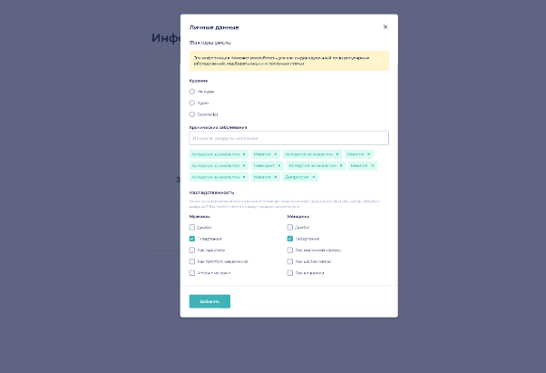

Мобильная версия:

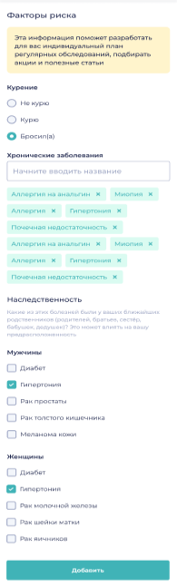

**Тестирование на соответствие макету (desktop, мобильная):**

Для тестирование на соответствие макету использовались инструменты: DevTools (эмуляция мобильных разрешений, размер шрифтов), PerfectPixel (расположение блоков, наличие всех необходимых элементов), ColorZilla (определение цветов).

**Баг-репорты:**

1) **ID** - NP-01

**Название:** DESKTOP Не соблюдены отступы заголовка "Заполните свой профиль" и текста "Заполните базовую информацию..."

**Описание:** Не соблюдены отступы заголовка "Заполните свой профиль" и текста "Заполните базовую информацию..." на странице "Информация о пациенте" в верстке Desktop 1920 px

**Приоритет:** Low

**Серьезность:** Trivial

**Предварительные шаги:** Перейти по ссылке<http://landing.hh-demo.np-internal.ru/>

**Тестовая среда:**

Устройство - Acer Nitro 5 / Браузер Chrome 125.0.6422.142

**Скриншот:** 

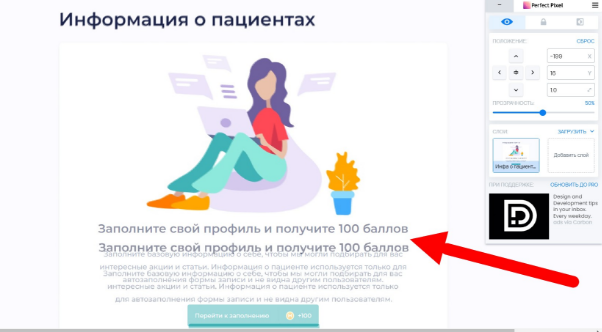

1) **ID** - NP-02

**Название:** DESKTOP Цвет фона верстки не соответствует цвету фона на макете на странице "Информация о пациентах"

**Описание:** Цвет фона верстки не соответствует цвету фона на макете на странице "Информация о пациентах" в верстке Desktop 1920 px

**Приоритет:** Low

**Серьезность:** Trivial

**Предварительные шаги:** Зайти на сайт<http://landing.hh-demo.np-internal.ru/>

**Ожидаемый результат:** Цвет фона #FAFBFF

**Фактический результат:** Цвет фона #FFFBFF

**Тестовая среда:** Устройство - Acer Nitro 5 / Браузер Chrome 125.0.6422.142

**Скриншот:**

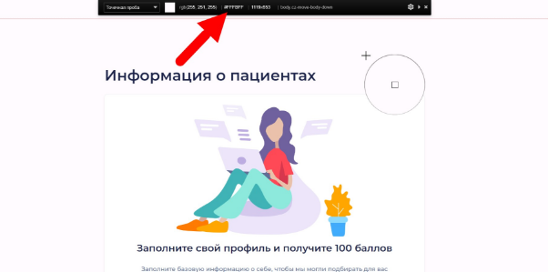

1) **ID** - NP-03

**Название:** МОБИЛЬНАЯ Фрейм верстки "Информация о пациентах" не покрывает видимую область.

**Приоритет:** Medium

**Серьезность:** Minor

**Описание:** Фрейм верстки "Информация о пациентах" не покрывает видимую область экрана в мобильной верстке

**Предварительные шаги:** Зайти на сайт<http://landing.hh-demo.np-internal.ru/> с мобильного устройства / эмулятора

**Ожидаемый результат:** Фрейм “Информация о пациентах” полностью покрывает видимую область

**Фактический результат:** Фрейм “Информация о пациентах” покрывает часть экрана

**Тестовая среда:**

Устройство - Acer Nitro 5 / Браузер Chrome 125.0.6422.142 / DevTools эмуляция разрешения iPhone 12 Pro

**Скриншот:**

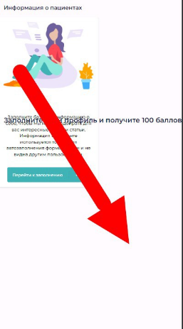

1) **ID** - NP-04

**Название:** МОБИЛЬНАЯ Размер шрифта заголовка "Личные данные" в попапе "Личные данные" не соответствует макету.

**Приоритет:** Medium

**Серьезность:** Trivial

**Предварительные шаги:**

1)Зайти на сайт<http://landing.hh-demo.np-internal.ru/>

2)Нажать кнопку “Перейти к заполнению”

**Ожидаемый результат:** Размер шрифта заголовка “Личные данные” 14 px

**Фактический результат:** Размер шрифта заголовка “Личные данные” 20 px

**Тестовая среда:**

Устройство - Acer Nitro 5 / Браузер Chrome 125.0.6422.142 / DevTools эмуляция разрешения iPhone 12 Pro

**Скриншот:**

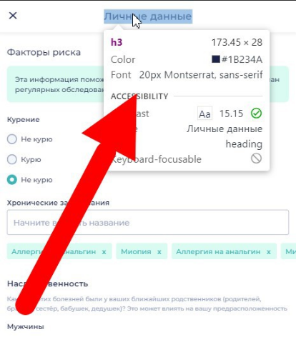** 

1) **ID** - NP-05

**Название:** МОБИЛЬНАЯ Добавлена лишняя иконка бонусов на кнопке "Добавить" в попапе "Личные данные"

**Описание:** Добавлена лишняя иконка бонусов на кнопке "Добавить" в попапе "Личные данные" в мобильной верстке

**Приоритет:** Low

**Серьезность:** Trivial

**Предварительные шаги:**

1)Зайти на сайт<http://landing.hh-demo.np-internal.ru/>

2)Нажать кнопку “Перейти к заполнению”

**Ожидаемый результат:** Содержание кнопки: Текст “Добавить”

**Фактический результат:** Содержание кнопки: Текст “Добавить / Иконка бонусов

**Тестовые данные:**

**Тестовая среда:** Устройство - Acer Nitro 5 / Браузер Chrome 125.0.6422.142 / DevTools эмуляция разрешения iPhone 12 Pro

**Скриншот:**

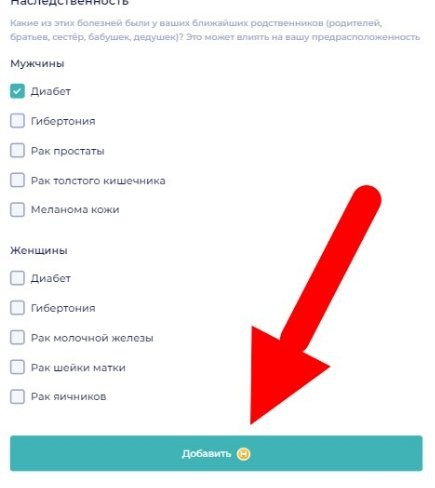

**Другие несоответствия макету:**

1) DESKTOP Цвет бэкграунда вокруг попапа "Личные данные" не соответствует макету.
1) DESKTOP Добавлена лишняя иконка бонусов на кнопке "Добавить" в попапе "Личные данные"
1) МОБИЛЬНАЯ Некорректно отображается заголовок "Заполните свой профиль" на странице "Информация о пациентах"
1) Отсутствует перенос тегов "Хронические заболевания" в попапе "Личные данные"
1) МОБИЛЬНАЯ Отсутствует иконка бонусов на кнопке "Перейти к заполнению" на странице "Информация о пациентах"
1) МОБИЛЬНАЯ Не соблюдены отступы заголовка "Заполните свой профиль" и текста "Заполните базовую информацию..." на странице "Информация о пациенте"
1) МОБИЛЬНАЯ Размер шрифта заголовка "Личные данные" в попапе "Личные данные" не соответствует макету.
1) Цвет бэкграунда div.warning-message "Эта информация поможет..." в попапе "Личные данные" не соответствует макету
1) Текст радиобаттона "Бросил(а)" в попапе "Личные данные" не соответствует макету

Всего в ходе тестирования верстки макета было обнаружено 13 несоответствий.

**Кроссбраузерное тестирование:**

Определил операционные системы для тестирования макета:

1) Windows 10
1) Windows 11
1) MacOS
1) Android

Браузеры

1) Chrome
1) Yandex
1) Firefox
1) Edge
1) Opera
1) Safari

Далее составил матрицу, провел тестирование:

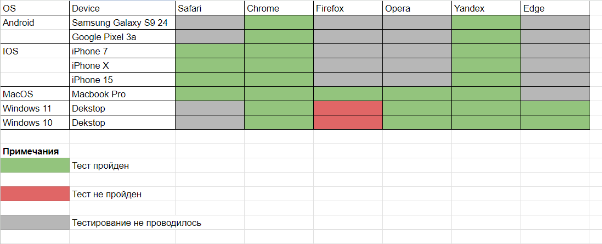

Обнаруженные дефекты:

1) ID - NP-19

**Название:** Некорректное отображение цветов тегов в попапе "Личные данные" в браузере Firefox.

**Приоритет:** Low

**Серьезность:** Trivial

**Предварительные шаги:**

1)Зайти на сайт<http://landing.hh-demo.np-internal.ru/>

2)Нажать кнопку “Перейти к заполнению”

**Ожидаемый результат:** Цвет бэкграунда тегов: #DAFBF1

**Фактический результат:** Цвет бэкграунда тегов: #FFF4CC

**Тестовая среда:**

Устройство - Acer Nitro 5 / Браузер Firefox v.126

**Скриншот:** 

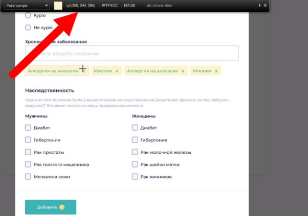

**Функциональность веб-элементов**

Чек лист проверок:

1) Кнопка “Перейти к заполнению”:
- При клике открывается попап “Личные данные”
1) Радиобаттоны “Курение”:
- При клике заполнен флагом
- Можно выбрать только один
1) Форма ввода “Хронические заболевания”:
- Отображение вводимого текста
- Ввод русская раскладка
- Ввод английская раскладка
- Ввод числа
- Ввод спец. символы

(Прим. Других требований к форме ввода не указано)

1) Теги “Хронические заболевания”:
- Создание тега (10 символов)
- Создание тега (30 символов)
- Удаление тега
- Перенос тега внутри фрейма попапа
1) Радиобаттоны “Наследственность”:
- При клике заполняются флагом
- Можно выбрать любое количество

**Баг-репорты:**

1) **ID** - NP-32

**Название:** Цвет вводимого текста в форму ввода "Хронические заболевания" не читаемый (белый на белом фоне)

**Приоритет:** Medium

**Серьезность:** Minor

**Предварительные шаги:**

1)Зайти на сайт<http://landing.hh-demo.np-internal.ru/>

2)Нажать кнопку “Перейти к заполнению”

**Шаги воспроизведения:**

1. Найти форму ввода “Хронические заболевания” в попапе “Личные данные”
1. Напечатать любую комбинацию букв / символов

**Ожидаемый результат:** Текст в форме ввода отображается и хорошо читаем

**Фактический результат:** Текст в форме ввода не отображается, не читаемый

**Тестовая среда:**

Устройство - Acer Nitro 5 / Браузер Chrome 125.0.6422.142

**Скриншот:**

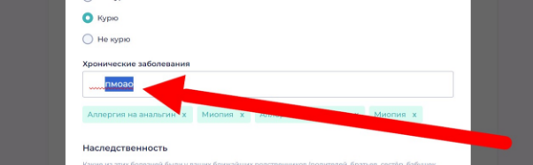

1) **ID** - NP-34

**Название:** Невозможно установить флаг в радиобаттоны "Наследственность" колонка "Женщины" в попапе "Личные данные"

**Приоритет:** Medium

**Серьезность:** Minor

**Предварительные шаги:**

1. Зайти на сайт<http://landing.hh-demo.np-internal.ru/>
1. Нажать на кнопку “Перейти к заполнению”

**Шаги воспроизведения:**

1. Найти в форме пункт “Наследственность”
1. Кликнуть на любой радиобаттон в колонке “Женщины”

**Ожидаемый результат:** Радиобаттон отмечен флагом

**Фактический результат:** Радиобаттон не отмечается флагом

**Тестовая среда:**

Устройство - Acer Nitro 5 / Браузер Chrome 125.0.6422.142

**Скриншот:** 

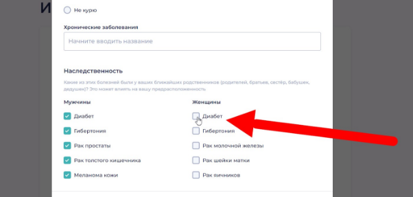

**Отчет по тестированию макета верстки**

#### **Отчет по тестированию верстки**
#### **1. Введение**
Цель данного отчета — предоставить результаты тестирования готовой вёрстки на соответствие макету, адаптивность, кроссбраузерность и функциональность.
#### **2. Объекты тестирования**
- HTML/CSS файлы вёрстки
- Мобильная и десктопная версии сайта
- Основные браузеры (Chrome, Firefox, Safari, Edge, Yandex)
#### **3. Области тестирования**
- Соответствие макету
- Адаптивность
- Кроссбраузерность
- Функциональность
#### **4. План тестирования**
Тестирование проводилось вручную, проверяя каждый пункт согласно следующим критериям:
##### **4.1. Соответствие макету**
- Проверка всех страниц на соответствие макету (включая проверку цветовой схемы, шрифтов, размеров и расположения элементов).
- Использование инструментов сравнения макетов (DevTools, Pixel Perfect).
##### **4.2. Адаптивность**
- Проверка корректного отображения страниц на различных устройствах (мобильные телефоны, планшеты, десктопы).
- Тестирование различных разрешений экранов (320px, 480px, 768px, 1024px, 1440px и т.д.).
- Использование DevTools для тестирования различных разрешений.
##### **4.3. Кроссбраузерность**
- Тестирование верстки на корректное отображение в различных браузерах (Chrome, Firefox, Safari, Edge, Yandex).
- Проверка совместимости с различными версиями браузеров.
- Использование эмулятора для тестирования BrowserStack.
##### **4.4. Функциональность**
- Проверка всех интерактивных web-элементов на корректность работы.

#### **5. Результаты тестирования**
##### **5.1. Соответствие макету**
1. **Страница Главная:**
   1. **Ожидаемый результат:** Полное соответствие макету
   1. **Фактический результат:** Отступы заголовков, фреймы, цвета не соответствует макету.
   1. **Статус:** Не пройден
1. **Попап Личные данные:**
   1. **Ожидаемый результат:** Полное соответствие макету
   1. **Фактический результат:** Отступы элементов, текст, дизайн кнопки “Добавить”,  цвета не соответствуют макету. Добавлены лишние элементы.
   1. **Статус:** Не пройден
##### **5.2. Адаптивность**
1. **Мобильные устройства (320px, 480px):**
   1. **Ожидаемый результат:** Корректное отображение всех элементов
   1. **Фактический результат:** Элементы отображаются некорректно, не соблюдены отступы согласно макету, фрейм не покрывает видимую область.
   1. **Статус:** Не пройден.
1. **Планшеты (768px, 1024px):**
   1. **Ожидаемый результат:** Корректное отображение всех элементов
   1. **Фактический результат:** Соответствие DESKTOP верстке, замечаний нет.
   1. **Статус:** Пройден
1. **Десктопы (1440px и выше):**
   1. **Ожидаемый результат:** Корректное отображение всех элементов
   1. **Фактический результат:** Полное соответствие ожиданиям
   1. **Статус:** Пройден
##### **5.3. Кроссбраузерность**
1. **Chrome:**
   1. **Ожидаемый результат:** Корректное отображение всех элементов
   1. **Фактический результат:** Полное соответствие
   1. **Статус:** Пройден
1. **Firefox:**
   1. **Ожидаемый результат:** Корректное отображение всех элементов
   1. **Фактический результат:** Цвет тегов “Хронические заболевания” в попапе “Личные данные” не соответствует макету.
   1. **Статус:** Пройден, с замечаниями.
1. **Safari:**
   1. **Ожидаемый результат:** Корректное отображение всех элементов
   1. **Фактический результат:** Полное соответствие
   1. **Статус:** Пройден
1. **Edge:**
   1. **Ожидаемый результат:** Корректное отображение всех элементов
   1. **Фактический результат:** Полное соответствие
   1. **Статус:** Пройден
1. **Yandex:**
   1. **Ожидаемый результат:** Корректное отображение всех элементов
   1. **Фактический результат:** Полное соответствие
   1. **Статус:** Пройден
##### **5.4. Функциональность**
1. **Кнопка:**
   1. **Ожидаемый результат:** Корректная работа кнопки
   1. **Фактический результат:** Полное соответствие 
   1. **Статус:** Пройден
1. **Форма ввода:**
   1. **Ожидаемый результат:** Корректная работа формы ввода
   1. **Фактический результат:** Некорректно отображается текст вводимый пользователем (белый на белом)
   1. **Статус:** Не пройден
1. **Radiobutton:**
   1. **Ожидаемый результат:** Корректная работа всех радиобаттонов
   1. **Фактический результат:** Радиобаттоны “Наследственность” колонка “Женщины” не работают
   1. **Статус:** Не пройден
1. **Теги:**
   1. **Ожидаемый результат:** Возможность добавить, удалить теги, при заполнении строки - перенос тегов
   1. **Фактический результат:** Отсутствует перенос тегов
   1. **Статус:** Пройден, с замечаниями
#### **6. Заключение**
Тестирование готовой верстки показало, что существуют значительные несоответствия и недочеты, требующие исправления. 
#### **Рекомендации:**
1. **Исправление макета:** Необходимо внести коррективы в отступы, фреймы, цвета и убрать лишние элементы на страницах "Главная" и "Попап Личные данные".
1. **Адаптивность:** Скорректировать отображение элементов на мобильных устройствах для соблюдения всех отступов и покрытия видимой области фреймом.
1. **Кроссбраузерность:** Исправить цвет тегов в попапе "Личные данные" для Firefox.
1. **Функциональность:**
   1. Исправить отображение вводимого текста в формах.
   1. Обеспечить корректную работу радиобаттонов в колонке "Женщины".
   1. Реализовать перенос тегов.

Проект требует доработок для полного соответствия макету, обеспечения адаптивности на мобильных устройствах, улучшения кроссбраузерности и функциональности. После внесения необходимых изменений рекомендуется провести повторное тестирование для подтверждения их корректности.

