## **Раздел 3 - Тестирование API**

В данном разделе описана работа с запросами REST API в Swagger и Postman на примере тестирования онлайн-магазина.

Перед началом тестирования запросов, необходимо авторизоваться, для этого через post запрос генерирую токен:

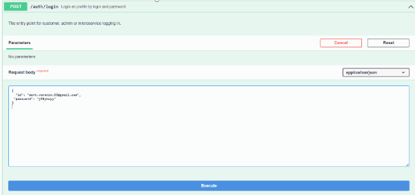

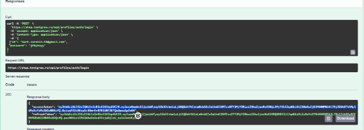

Данный токен использую для авторизации
 
**Swagger:**

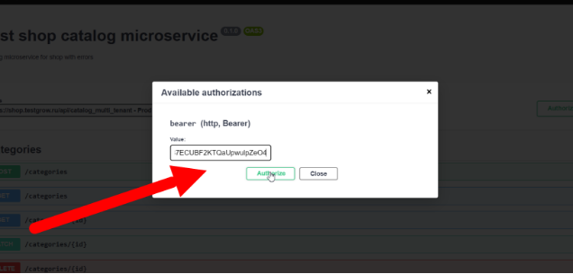**

**Postman:** Auth Type выбираю Bearer Token

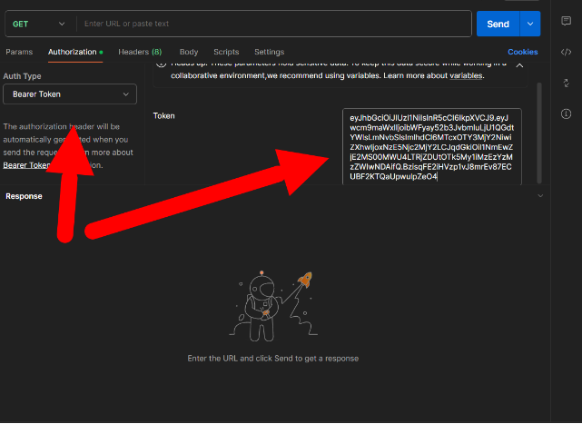

### 1) **Запрос GET**

   Задача: Протестировать метод GET Customers

   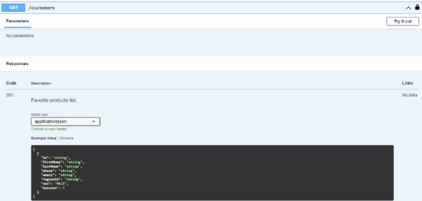

   Try it out —-> Execute

   

   Код ответа 200, проверяем тело ответа.

   **В Postman**

   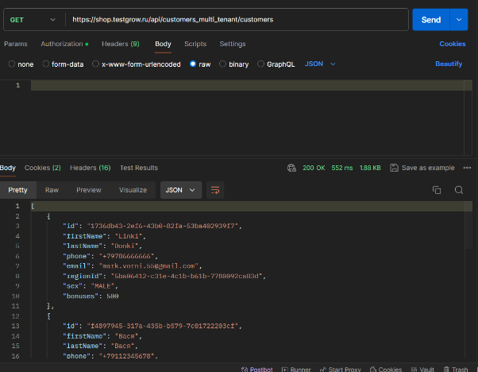

 

### 2) **Запрос POST**

   Тестирую запрос POST на Customers добавив нового покупателя

   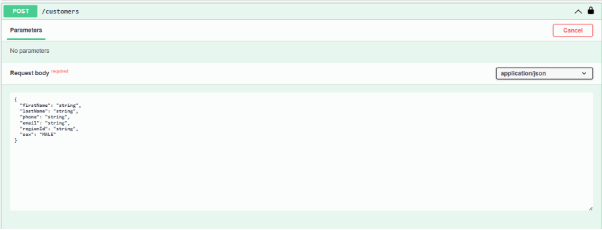

   Дополнительно необходимо узнать “RegionId” с помощью GET/Region

   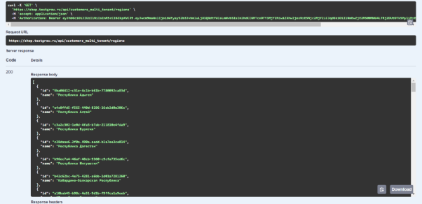

   Ввожу все необходимые данные в тело запроса в JSON формате: 

   ```
   {

   `  `"firstName": "Portfolio",

   `  `"lastName": "Man",

   `  `"phone": "+79222222222",

   `  `"email": "malco@gmail.com",

   `  `"regionId": "5ba06412-c31e-4c1b-b61b-7780092ca83d",

   `  `"sex": "MALE"

   }
   ```

Отправляю запрос POST.

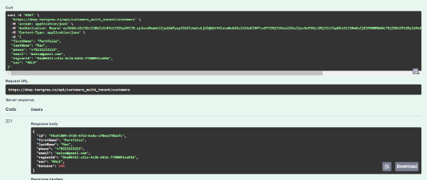

Проверяю код ответа 201.

Далее с помощью запроса GET/Customers/{id} проверяю, что пользователь добавлен.

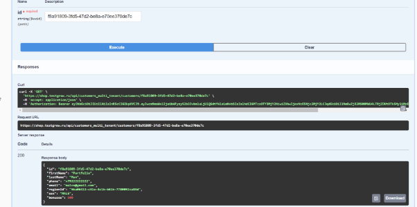

Теперь протестируем в Postman, добавив точно такого же пользователя с таким же email.

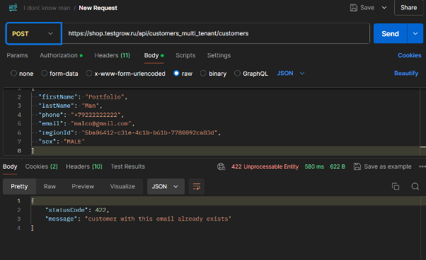

В ответе видно, что система не позволяет создать двух пользователей с одинаковой почтой (код 422 “пользователь с этой почтой уже есть в системе”) 

### 3) **Запрос PATCH**

   Теперь попробуем изменить почту созданного аккаунта с помощью запроса PATCH:

   С помощью запроса GET/Customers/{id} узнаем id, в теле PATCH/Customers/{id} указываем новую почту:

   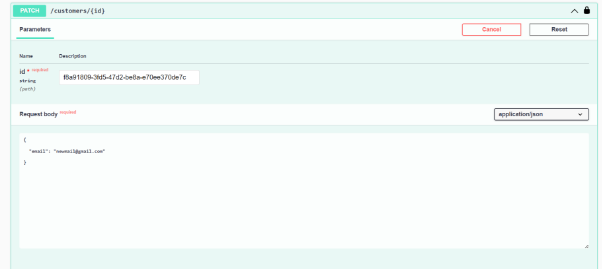

   Отправляем запрос.

   Ответ:

   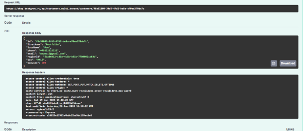

   С помощью запроса GET проверяю, что почта изменилась

   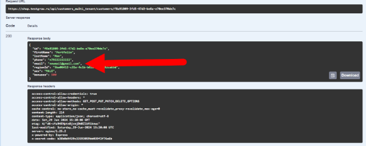

   В Postman изменим фамилию с “Man” на “Oleg”:

   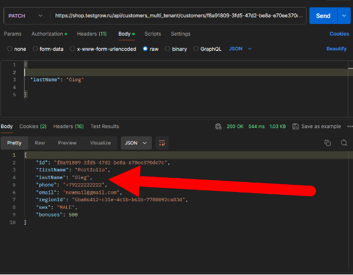


### 4) **Запрос DELETE**

Удаляю созданного покупателя с помощью запроса DELETE/Customers/{id}

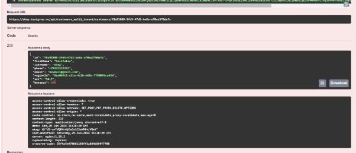

Проверяю, что при запросе GET/Customers/{id} выдает 404

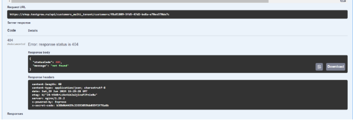


