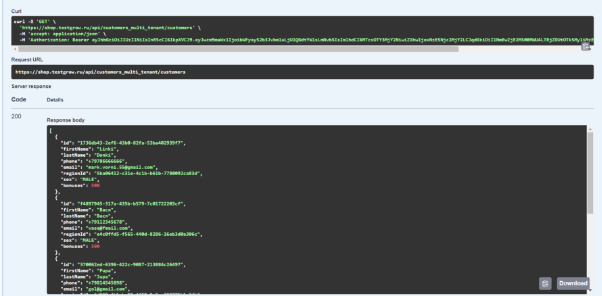

## **Раздел 3 - Тестирование API**
### **Часть 1 - Ручное тестирование API**
В данном разделе описана работа с запросами REST API в Swagger и Postman на примере тестирования онлайн-магазина.

Перед началом тестирования запросов, необходимо авторизоваться, для этого через post запрос генерирую токен:


Данный токен использую для авторизации
 
**Swagger:**

**

**Postman:** Auth Type выбираю Bearer Token


### 1) **Запрос GET**

   Задача: Протестировать запрос GET Customers

   

   Try it out —-> Execute

   

   Код ответа 200, проверяем тело ответа.

   **В Postman**

   

 

### 2) **Запрос POST**

   Тестирую запрос POST на Customers добавив нового покупателя

   

   Дополнительно необходимо узнать “RegionId” с помощью GET/Region

   

   Ввожу все необходимые данные в тело запроса в JSON формате: 

   ```
   {

   `  `"firstName": "Portfolio",

   `  `"lastName": "Man",

   `  `"phone": "+79222222222",

   `  `"email": "malco@gmail.com",

   `  `"regionId": "5ba06412-c31e-4c1b-b61b-7780092ca83d",

   `  `"sex": "MALE"

   }
   ```

Отправляю запрос POST.


Проверяю код ответа 201.

Далее с помощью запроса GET/Customers/{id} проверяю, что пользователь добавлен.


Теперь протестируем в Postman, добавив точно такого же пользователя с таким же email.


В ответе видно, что система не позволяет создать двух пользователей с одинаковой почтой (код 422 “пользователь с этой почтой уже есть в системе”) 

### 3) **Запрос PATCH**

   Теперь попробуем изменить почту созданного аккаунта с помощью запроса PATCH:

   С помощью запроса GET/Customers/{id} узнаем id, в теле PATCH/Customers/{id} указываем новую почту:

   

   Отправляем запрос.

   Ответ:

   

   С помощью запроса GET проверяю, что почта изменилась

   

   В Postman изменим фамилию с “Man” на “Oleg”:

   


### 4) **Запрос DELETE**

Удаляю созданного покупателя с помощью запроса DELETE/Customers/{id}


Проверяю, что при запросе GET/Customers/{id} выдает 404


### **Часть 2 - Автоматизация тестирования API для регрессионных тестов** 


Необходимо протестировать методы GET, PATCH, POST и DELETE онлайн-библиотеки. Для автоматизации тест-рана создаю следующую итерацию. POST (создаем новую книгу для библиотеки) > PATCH(меняем год выпуска книги) > GET{id} (проверяем наличие книги с измененным годом выпуска) > DELETE (удаляем созданную книгу) > GET{id} (проверяем 404).

Для создания тест-рана создал новую папку в коллекции, затем добавил туда методы в нужном порядке.


Теперь с помощью скрипта задаем переменную на уровне коллекции - 

{{id}} - id созданной книги, для дальнейшей работы с методами. Эту переменную скрипт будет брать из ответа метода POST

```javascript

const id = pm.response.json().id

pm.collectionVariables.set("id", id)

```

Далее пишем пост-скрипты для каждого метода в соответствии с требованиями:

1) POST запрос

```javascript

// Тест на статус-код

pm.test("Response status code is 201", function () {

`  `pm.response.to.have.status(201);

});

// Тест на время ответа сервера

pm.test("Response time is less than 300ms", function () {

`  `pm.expect(pm.response.responseTime).to.be.below(300);

});

` `// Тест на тип данных в теле ответа

pm.test("Response schema for the created book", function () {

`  `const responseData = pm.response.json();


`  `pm.test("Check data types in the response", function () {

`    `pm.expect(responseData.id).to.be.a('string');

`    `pm.expect(responseData.title).to.be.a('string');

`    `pm.expect(responseData.author).to.be.a('string');

`    `pm.expect(responseData.genre).to.be.a('string');

`    `pm.expect(responseData.yearPublished).to.be.a('number');

`    `pm.expect(responseData.checkedOut).to.be.a('boolean');

`    `pm.expect(responseData.isPermanentCollection).to.be.a('boolean');

`    `pm.expect(responseData.createdAt).to.be.a('string');

`  `});

`  `// Дополнительная проверка формата даты в createdAt

`  `pm.test("Check date format in createdAt", function () {

`    `const dateRegex = /^\d{4}-\d{2}-\d{2}T\d{2}:\d{2}:\d{2}\.\d{3}Z$/;

`    `pm.expect(responseData.createdAt).to.match(dateRegex);

`  `});

});


```

2) PATCH запрос

```javascript

// Тест на статус-код

pm.test("Check 200", function() {

`  `const responseCode = pm.response.code;

`  `pm.expect(responseCode).to.equal(200);

});

// Тест на время ответа сервера

pm.test("Response time is less than 300ms", function () {

`  `pm.expect(pm.response.responseTime).to.be.below(300);

});

```


3) GET{id} запрос

```javascript

// Тест на статус-код

pm.test("Check 200", function() {

`  `const responseCode = pm.response.code;

`  `pm.expect(responseCode).to.equal(200);

});

// Тест на изменение года

pm.test("Check New Year", function() {

`    `const yearPublished = pm.response.json().yearPublished;

`    `pm.expect(yearPublished).to.equal(2020);

});

// Тест на время ответа сервера

pm.test("Response time is less than 300ms", function () {

`  `pm.expect(pm.response.responseTime).to.be.below(300);

});


```


4) DELETE запрос

```javascript

pm.test("Check if book DELETE", function() {

`    `let response=pm.response.text();

`    `pm.expect(response).to.equal("");

});

// Тест на время ответа сервера

pm.test("Response time is less than 300ms", function () {

`  `pm.expect(pm.response.responseTime).to.be.below(300);

});

```


4) GET{id} запрос

```javascript

// Тест на статус-код

pm.test("Check 404", function() {

`  `const responseCode = pm.response.code;

`  `pm.expect(responseCode).to.equal(404);

});

```


Далее создаем тестовые данные в формате csv, для нескольких итераций проверок. При наличии требований к полям используем классы эквивалентности и граничные значения.


В методе POST в теле запроса устанавливаем свойства ключей как переменные.


Тоже самое делаю с методом PATCH


Заливаю тестовые данные в Postman и запускаю ран.


После анализирую результаты.

