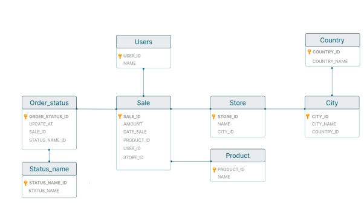

**Раздел 4: SQL-запросы PostgreSQL**

Схема БД:

**Запрос на получение целой таблицы**

select \* from City

**Запрос на вывод столбца city\_name**

select city\_name from City

**Запрос на вывод с диапазоном**

**Вариант 1:** select \* from City where city\_id > 5 and city\_id<= 8

**Вариант 2:** select \* from City where city\_id BETWEEN 6 and 8

**Запрос на вывод значения по шаблону** 
Все строки, где в city\_name присутствует “1” в любой позиции :

select \* from city WHERE city\_name like’%1%’ 

**Запрос на вывод с сортировкой по убыванию:**

select \* from City ORDER BY city\_id DESC

**Вложенный запрос:**

Найти 10 любых покупок с количеством проданных продуктов в заказе более 5000 р в статусе 3

select \* from sale where sale\_id in 

(select sale\_id from order\_status where status\_name\_id=3) 

and amount>5000 LIMIT 10

**Оператор JOIN**

Клиент с id 5 обратился с просьбой выгрузить все данные по покупкам, которые он совершал. Необходимо подготовить один скрипт для выгрузки данных из двух таблиц sale и users одновременно. 

Для решение задачи требуется использовать конструкцию JOIN.

SELECT sale.\*, users.name

FROM sale

JOIN users 

ON sale.user\_id = users.user\_id

WHERE sale.user\_id = 5;

**Оператор UNION**

Получить таблицу с одним столбцом, содержащим все города и страны, id элементов которых меньше 10.

SELECT city\_name AS name

FROM City

WHERE city\_id < 10

UNION

SELECT country\_name AS name

FROM Country

WHERE country\_id < 10;

**Операторы по изменению таблицы:**

1) **Update -** изменение существующей записи

   update product set name=’Test’ where name=’Product\_1’

1) **Delete -** удаление существующей записи

   delete from product where product\_id=4

1) **Insert into -** создание новой строки

   insert into product values (99,’Product\_99’)’
