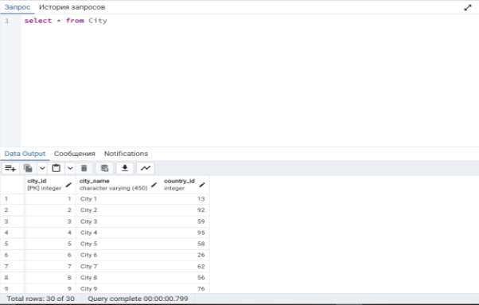
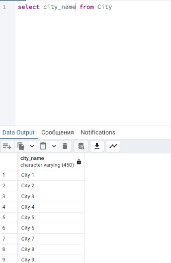
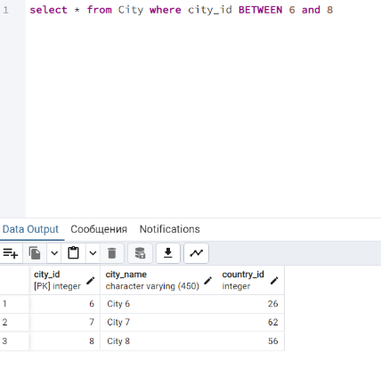
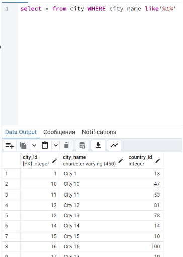
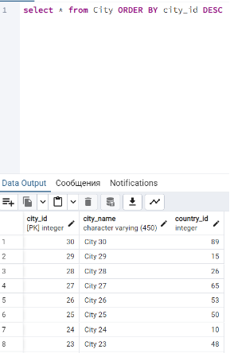
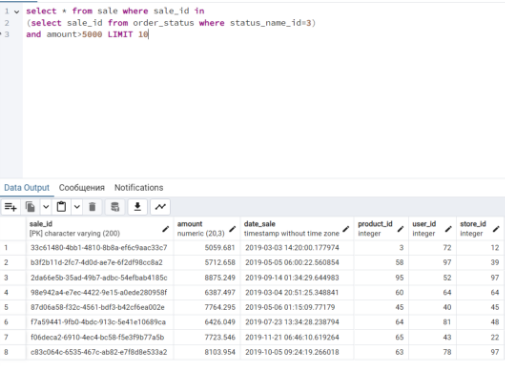
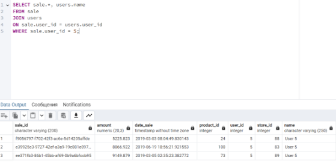
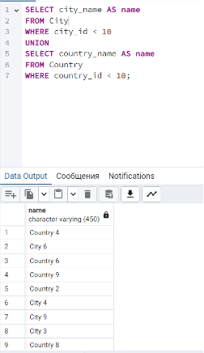

## **Раздел 4: SQL-запросы PostgreSQL**

Схема БД:


### **Запрос на получение целой таблицы**
```
select * from City
```


### **Запрос на вывод столбца city_name**
```
select city_name from City
```



### **Запрос на вывод с диапазоном**

**Вариант 1:** 
```
select * from City where city_id > 5 and city_id<= 8
```
**Вариант 2:** 
```
select * from City where city_id BETWEEN 6 and 8
```


### **Запрос на вывод значения по шаблону** 
Все строки, где в city_name присутствует “1” в любой позиции :
```
select * from city WHERE city_name like’%1%’ 
```


### **Запрос на вывод с сортировкой по убыванию:**
```
select * from City ORDER BY city_id DESC
```


### **Вложенный запрос:**

Найти 10 любых покупок с количеством проданных продуктов в заказе более 5000 р в статусе 3
```
select * from sale where sale_id in 

(select sale_id from order_status where status_name_id=3) 

and amount>5000 LIMIT 10
```



### **Оператор JOIN**

Клиент с id 5 обратился с просьбой выгрузить все данные по покупкам, которые он совершал. Необходимо подготовить один скрипт для выгрузки данных из двух таблиц sale и users одновременно. 

Для решение задачи требуется использовать конструкцию JOIN.
```
SELECT sale.*, users.name

FROM sale

JOIN users 

ON sale.user_id = users.user_id

WHERE sale.user_id = 5;
```


### **Оператор UNION**

Получить таблицу с одним столбцом, содержащим все города и страны, id элементов которых меньше 10.
```
SELECT city_name AS name

FROM City

WHERE city_id < 10

UNION

SELECT country_name AS name

FROM Country

WHERE country_id < 10;
```



### **Операторы по изменению таблицы:**

1) **Update -** изменение существующей записи
```
   update product set name=’Test’ where name=’Product_1’
```
2) **Delete -** удаление существующей записи
```
   delete from product where product_id=4
```
3) **Insert into -** создание новой строки
```
   insert into product values (99,’Product_99’)’
```
